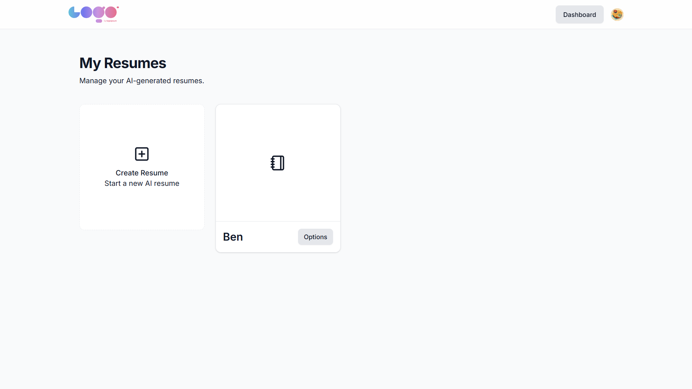

# Project Title

AI Resume Builder

# Overview

The AI Resume Builder is a modern, responsive web application designed to help users effortlessly create professional, standard-compliant resumes. By leveraging AI (Google Gemini), the application can automatically generate tailored resume bullet points based on a user's role and experience. It features a complete rich text editor, live side-by-side previews, multi-section forms (for education, experience, skills, etc.), and secure authentication. All data is synchronized and stored in real-time.

# Features

* **AI-powered resume bullet generation:** Automatically generate professional experience descriptions using Google Gemini AI.
* **Resume editor:** A comprehensive, multi-step rich text editor for Personal Details, Summaries, Experience, Education, and Skills.
* **Live resume preview:** A dynamic, real-time preview component that instantly reflects your changes as you type.
* **Resume PDF export:** Seamlessly download your finished resume as a fully formatted PDF.
* **Resume sharing:** Generate unique, public URLs to share your digital resume with recruiters.
* **Authentication system:** Secure user login, session management, and route protection powered by Clerk.
* **Resume dashboard:** A dedicated user dashboard to create, manage, edit, and delete multiple resumes securely stored in the cloud.

# Demo

> *Placeholders for your demo media.*




# Tech Stack

* **Frontend:** React 19, Vite
* **Styling:** Tailwind CSS, Radix UI Primitives, Lucide Icons, `next-themes` (Dark/Light mode)
* **State Management:** React Context API (`ResumeInfoContext`)
* **Routing:** React Router DOM v7
* **Authentication:** Clerk (`@clerk/clerk-react`)
* **Database & Backend:** Convex (Real-time DB and Serverless functions)
* **AI Tools:** Google Gemini API (`@google/generative-ai`)
* **Utilities:** `react-simple-wysiwyg` (Rich Text), `sonner` (Toast notifications)

# Architecture

* **Resume Editor:** A multi-step form built with modular React components (`src/features/resumeEditor/form`). It is connected to a Context API (`ResumeInfoContext`) to maintain and sync the builder's state globally across the application.
* **AI Generation:** Integrates the Google Gemini API (via `src/lib/AIModel.js`) to process user inputs (like Job Title) and generate contextual, professional resume bullet points instantly.
* **Resume Preview:** A parallel, read-only live-updating component synced directly to the context state. It formats the underlying data into a printable visual layout.
* **Resume Storage:** Utilizes Convex, a real-time reactive database. Resume data objects are asynchronously pushed and pulled directly from the UI, with schemas and backend functions secured in the `/convex` directory.
* **Auth system:** Clerk handles secure authentication, effectively locking the dashboard and API routes behind protected layouts, ensuring user data remains private.
* **Routing:** Implemented via React Router mappings, defining precise paths for `/dashboard`, structured editor states (`/dashboard/resume/:id/edit`), and standalone public sharing pages.

# Installation

Follow these steps to set up and run the project locally.

```bash
# 1. Clone the repository
git clone https://github.com/yourusername/ai-resume-builder.git

# 2. Navigate to the project directory
cd ai-resume-builder

# 3. Install NPM dependencies
npm install

# 4. Set up environment variables
# Create a .env.local file in the root directory mapping the required keys (see below).

# 5. Start the Convex development server (in one terminal)
npx convex dev

# 6. Start the Vite frontend server (in another terminal)
npm run dev
```

# Environment Variables

To properly run this application, you will need to create a `.env.local` file in the root directory and populate it with the following required environment schemas:

```env
# Convex Backend Identifiers
CONVEX_DEPLOYMENT=your_convex_deployment
VITE_CONVEX_URL=your_vite_convex_url

# Clerk Authentication Publishable Key
VITE_CLERK_PUBLISHABLE_KEY=your_clerk_publishable_key

# Google AI (Gemini) API Key
VITE_GOOGLE_AI_API_KEY=your_google_ai_api_key
```

# Usage

1. **Sign in:** Create a new account or log in securely using the Clerk authentication portal.
2. **Create a resume:** From your Dashboard, initialize a new resume providing a foundational Title.
3. **Edit resume sections:** Navigate through the structured builder forms to input Personal Data, write a Summary, and sequentially add Experience, Education, and Skills.
4. **Use AI to generate bullet points:** Within the Experience form, press the "Generate from AI" button to auto-hydrate professional job descriptions based on the current title.
5. **Download resume as PDF:** Once all steps are successfully completed, navigate to the final view to export the resume as a PDF or copy the public link.

# Folder Structure

```text
AI-Resume-Builder/
├── convex/               # Backend DB schemas, API endpoints, and serverless functions 
├── src/                  
│   ├── assets/           # Static media assets like images and global CSS
│   ├── components/       # Reusable layout and custom UI components (Radix + Custom UI)
│   ├── features/         # Modular feature-driven directory
│   │   ├── auth/         # Login and authentication guard views
│   │   ├── dashboard/    # User dashboard for browsing and creating resumes
│   │   ├── home/         # Application landing page
│   │   └── resumeEditor/ # Core multi-step builder forms and live preview systems
│   ├── lib/              # Utility configurations and external SDK integrations (AI Model)
│   ├── App.jsx           # Main App context provider and template wrapper
│   └── main.jsx          # React initialization and routing definitions
├── .env.local            # Environment variables mapped for local dev
├── package.json          # Dependency and custom script management
├── tailwind.config.js    # TailwindCSS styling and animation configuration
├── eslint.config.js      # Linter rules and configuration
└── vite.config.js        # Vite bundler options and plugins
```

* **`/convex`**: Essential for backend logic. Holds real-time data schemas and handlers.
* **`/src/features`**: Splits the frontend up by distinct product requirements. Keeps scaling clean.
* **`/src/components`**: Home to highly reusable generic UI chunks (e.g., buttons, inputs, dialogs).

# Key Components

* **ResumeEditor:** Located in `src/features/resumeEditor/FormSection.jsx`. The command center of the app that manages user inputs using context, allowing seamless transitions between the active editing sections.
* **ResumePreview:** Located in `src/features/resumeEditor/preview/`. Actively listens to real-time `ResumeInfoContext` state shifts to beautifully map out plain text array data into polished typography layouts.
* **Dashboard:** Located in `src/features/dashboard`. The post-login command hub where users view fetched lists of their existing templates, create base resumes (`AddResume.jsx`), and perform edits.
* **Auth:** Integration flows with Clerk bridging frontend views to guarded `<RequireAuth />` routing states.

# Deployment

The application is structured to decouple the frontend Client code from the Convex Backend.

1. **Frontend Deployment (Vercel, Netlify, Render):**
   * Connect your GitHub repository to your host.
   * Set your precise Build Command to `npm run build` and your Output Directory to `dist`.
   * Add all `VITE_*` environment variables in the host's project settings panel.
   * Publish the site.

2. **Backend Deployment (Convex):**
   * Run the production deployment script via terminal: `npx convex deploy`
   * Assure the Convex production dashboard has access to identical environmental safeguards used in `.env.local`.

# Future Improvements

* **Multiple resume templates:** Implement a suite of interchangeable visual templates (e.g., Creative, Standard, Tech).
* **ATS optimization:** Add real-time keyword tracking and suggestions based on generic JD inputs.
* **Resume scoring:** Provide an automated 0-100 metric feedback loop scoring grammar, length, and power words based on chosen industries.
* **Cover letter generator:** Scale the existing Gemini Context to rapidly produce customized intro cover letters matching the generated resume.
* **Public resume link enhancements:** Allow dynamic custom domain mapping or more robust analytics for public resume sharing.

# License

MIT License

Copyright (c) 2026

Permission is hereby granted, free of charge, to any person obtaining a copy of this software and associated documentation files (the "Software"), to deal in the Software without restriction, including without limitation the rights to use, copy, modify, merge, publish, distribute, sublicense, and/or sell copies of the Software, and to permit persons to whom the Software is furnished to do so, subject to the following conditions:

The above copyright notice and this permission notice shall be included in all copies or substantial portions of the Software.

THE SOFTWARE IS PROVIDED "AS IS", WITHOUT WARRANTY OF ANY KIND, EXPRESS OR IMPLIED, INCLUDING BUT NOT LIMITED TO THE WARRANTIES OF MERCHANTABILITY, FITNESS FOR A PARTICULAR PURPOSE AND NONINFRINGEMENT. IN NO EVENT SHALL THE AUTHORS OR COPYRIGHT HOLDERS BE LIABLE FOR ANY CLAIM, DAMAGES OR OTHER LIABILITY, WHETHER IN AN ACTION OF CONTRACT, TORT OR OTHERWISE, ARISING FROM, OUT OF OR IN CONNECTION WITH THE SOFTWARE OR THE USE OR OTHER DEALINGS IN THE SOFTWARE.
